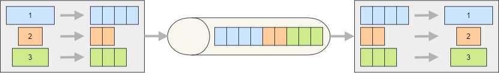

# Consuming Chunked Messages

When messages are split into smaller parts (chunks) by the producer, the consumer is responsible for reassembling them into the original message before delivering it to the subscribers. Silverback handles chunked messages automatically, so in most cases you don't need to write any special consumer-side logic (if the messages are produced using Silverback or another framework that adds compatible headers).

<figure>
	
    <figcaption>The messages are being split into small chunks and reassembled on the consumer side.</figcaption>
</figure>

## Consumer Configuration

No special configuration is required on the consumer to support chunked messages.

> [!Note]
> All chunks belonging to the same message are acknowledged/committed at once, when the full message has been reassembled and processed by the subscriber. Similarly, when an exception is thrown, the error policy is applied to all chunks.

> [!Important]
> The chunks belonging to the same message are expected to be contiguous and in strict order. When using Kafka, the chunks belonging to the same message are also supposed to be in the same partition.

## Additional Resources

- [API Reference](xref:Silverback)
- <xref:producing-chunking> guide
- <xref:default-headers> guide
